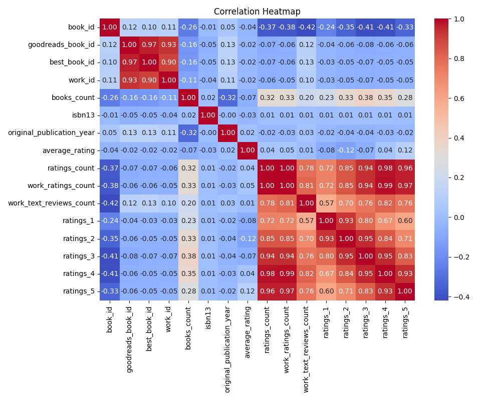

# Automated Data Analysis Report

## Dataset Summary
**Shape:** (10000, 23)

**Column Types:**
- book_id: int64
- goodreads_book_id: int64
- best_book_id: int64
- work_id: int64
- books_count: int64
- isbn: object
- isbn13: float64
- authors: object
- original_publication_year: float64
- original_title: object
- title: object
- language_code: object
- average_rating: float64
- ratings_count: int64
- work_ratings_count: int64
- work_text_reviews_count: int64
- ratings_1: int64
- ratings_2: int64
- ratings_3: int64
- ratings_4: int64
- ratings_5: int64
- image_url: object
- small_image_url: object

**Missing Values:**
- book_id: 0
- goodreads_book_id: 0
- best_book_id: 0
- work_id: 0
- books_count: 0
- isbn: 700
- isbn13: 585
- authors: 0
- original_publication_year: 21
- original_title: 585
- title: 0
- language_code: 1084
- average_rating: 0
- ratings_count: 0
- work_ratings_count: 0
- work_text_reviews_count: 0
- ratings_1: 0
- ratings_2: 0
- ratings_3: 0
- ratings_4: 0
- ratings_5: 0
- image_url: 0
- small_image_url: 0

**Summary Statistics:**
- book_id: {'count': 10000.0, 'unique': nan, 'top': nan, 'freq': nan, 'mean': 5000.5, 'std': 2886.8956799071675, 'min': 1.0, '25%': 2500.75, '50%': 5000.5, '75%': 7500.25, 'max': 10000.0}
- goodreads_book_id: {'count': 10000.0, 'unique': nan, 'top': nan, 'freq': nan, 'mean': 5264696.5132, 'std': 7575461.863589611, 'min': 1.0, '25%': 46275.75, '50%': 394965.5, '75%': 9382225.25, 'max': 33288638.0}
- best_book_id: {'count': 10000.0, 'unique': nan, 'top': nan, 'freq': nan, 'mean': 5471213.5801, 'std': 7827329.890719961, 'min': 1.0, '25%': 47911.75, '50%': 425123.5, '75%': 9636112.5, 'max': 35534230.0}
- work_id: {'count': 10000.0, 'unique': nan, 'top': nan, 'freq': nan, 'mean': 8646183.4246, 'std': 11751060.824080039, 'min': 87.0, '25%': 1008841.0, '50%': 2719524.5, '75%': 14517748.25, 'max': 56399597.0}
- books_count: {'count': 10000.0, 'unique': nan, 'top': nan, 'freq': nan, 'mean': 75.7127, 'std': 170.47072765025834, 'min': 1.0, '25%': 23.0, '50%': 40.0, '75%': 67.0, 'max': 3455.0}
- isbn: {'count': 9300, 'unique': 9300, 'top': '375700455', 'freq': 1, 'mean': nan, 'std': nan, 'min': nan, '25%': nan, '50%': nan, '75%': nan, 'max': nan}
- isbn13: {'count': 9415.0, 'unique': nan, 'top': nan, 'freq': nan, 'mean': 9755044298883.463, 'std': 442861920665.57336, 'min': 195170342.0, '25%': 9780316192995.0, '50%': 9780451528640.0, '75%': 9780830777175.0, 'max': 9790007672390.0}
- authors: {'count': 10000, 'unique': 4664, 'top': 'Stephen King', 'freq': 60, 'mean': nan, 'std': nan, 'min': nan, '25%': nan, '50%': nan, '75%': nan, 'max': nan}
- original_publication_year: {'count': 9979.0, 'unique': nan, 'top': nan, 'freq': nan, 'mean': 1981.987674115643, 'std': 152.57666516754668, 'min': -1750.0, '25%': 1990.0, '50%': 2004.0, '75%': 2011.0, 'max': 2017.0}
- original_title: {'count': 9415, 'unique': 9274, 'top': ' ', 'freq': 5, 'mean': nan, 'std': nan, 'min': nan, '25%': nan, '50%': nan, '75%': nan, 'max': nan}
- title: {'count': 10000, 'unique': 9964, 'top': 'Selected Poems', 'freq': 4, 'mean': nan, 'std': nan, 'min': nan, '25%': nan, '50%': nan, '75%': nan, 'max': nan}
- language_code: {'count': 8916, 'unique': 25, 'top': 'eng', 'freq': 6341, 'mean': nan, 'std': nan, 'min': nan, '25%': nan, '50%': nan, '75%': nan, 'max': nan}
- average_rating: {'count': 10000.0, 'unique': nan, 'top': nan, 'freq': nan, 'mean': 4.002191000000001, 'std': 0.25442748053872905, 'min': 2.47, '25%': 3.85, '50%': 4.02, '75%': 4.18, 'max': 4.82}
- ratings_count: {'count': 10000.0, 'unique': nan, 'top': nan, 'freq': nan, 'mean': 54001.2351, 'std': 157369.95643554674, 'min': 2716.0, '25%': 13568.75, '50%': 21155.5, '75%': 41053.5, 'max': 4780653.0}
- work_ratings_count: {'count': 10000.0, 'unique': nan, 'top': nan, 'freq': nan, 'mean': 59687.3216, 'std': 167803.7852374182, 'min': 5510.0, '25%': 15438.75, '50%': 23832.5, '75%': 45915.0, 'max': 4942365.0}
- work_text_reviews_count: {'count': 10000.0, 'unique': nan, 'top': nan, 'freq': nan, 'mean': 2919.9553, 'std': 6124.378131569911, 'min': 3.0, '25%': 694.0, '50%': 1402.0, '75%': 2744.25, 'max': 155254.0}
- ratings_1: {'count': 10000.0, 'unique': nan, 'top': nan, 'freq': nan, 'mean': 1345.0406, 'std': 6635.626262783459, 'min': 11.0, '25%': 196.0, '50%': 391.0, '75%': 885.0, 'max': 456191.0}
- ratings_2: {'count': 10000.0, 'unique': nan, 'top': nan, 'freq': nan, 'mean': 3110.885, 'std': 9717.123578396993, 'min': 30.0, '25%': 656.0, '50%': 1163.0, '75%': 2353.25, 'max': 436802.0}
- ratings_3: {'count': 10000.0, 'unique': nan, 'top': nan, 'freq': nan, 'mean': 11475.8938, 'std': 28546.449183182456, 'min': 323.0, '25%': 3112.0, '50%': 4894.0, '75%': 9287.0, 'max': 793319.0}
- ratings_4: {'count': 10000.0, 'unique': nan, 'top': nan, 'freq': nan, 'mean': 19965.6966, 'std': 51447.35838380058, 'min': 750.0, '25%': 5405.75, '50%': 8269.5, '75%': 16023.5, 'max': 1481305.0}
- ratings_5: {'count': 10000.0, 'unique': nan, 'top': nan, 'freq': nan, 'mean': 23789.8056, 'std': 79768.88561077163, 'min': 754.0, '25%': 5334.0, '50%': 8836.0, '75%': 17304.5, 'max': 3011543.0}
- image_url: {'count': 10000, 'unique': 6669, 'top': 'https://s.gr-assets.com/assets/nophoto/book/111x148-bcc042a9c91a29c1d680899eff700a03.png', 'freq': 3332, 'mean': nan, 'std': nan, 'min': nan, '25%': nan, '50%': nan, '75%': nan, 'max': nan}
- small_image_url: {'count': 10000, 'unique': 6669, 'top': 'https://s.gr-assets.com/assets/nophoto/book/50x75-a91bf249278a81aabab721ef782c4a74.png', 'freq': 3332, 'mean': nan, 'std': nan, 'min': nan, '25%': nan, '50%': nan, '75%': nan, 'max': nan}

## LLM Narrative
The dataset contains a comprehensive collection of information on 10,000 books, encapsulated in 23 columns detailing various attributes such as book identifiers, ratings, publication details, author names, ISBNs, and images. 

### General Characteristics

1. **Book IDs and Identifiers**:
   - Each book is assigned unique identifiers (book_id, goodreads_book_id, best_book_id, work_id) ensuring easy referencing within the dataset. The mean book_id is approximately 5000, indicating a systematic numeric assignment of books.

2. **Authors**:
   - The dataset includes 4,664 unique authors, with Stephen King being the most frequently mentioned author (60 occurrences). This highlights the presence of popular authors whose works are likely well-rated or widely read.

### Missing Values Analysis

- Significant missing values exist in several columns:
  - **ISBN** shows 700 missing entries, while **isbn13** has 585 missing entries. These values can limit the ability to accurately identify and differentiate titles.
  - The **original_publication_year** field has 21 missing entries, and field analysis indicates that it ranges from as early as -1750 to as late as 2017, suggesting the inclusion of historical texts alongside contemporary works.
  - The **language_code** has 1,084 missing values, which may impact diversity and representation in the dataset.

### Publication Years and Language

- The mean original publication year is 1981.98, suggesting a predominance of relatively modern literature. Notably, the dataset spans books that were published from the oldest in 1750 to the most recent in 2017.
- With 25 unique language codes, English (represented by the code 'eng') is the most common, appearing in 6,341 instances, indicating a significant focus on English literature.

### Ratings and Reviews

1. **Average Rating**:
   - The average rating across all books is approximately 4.00, with a maximum rating of 4.82. This indicates a generally positive reception among readers.
   - The distribution of ratings suggests that most books fall in the upper echelons of rating, with lower ratings being less common, evidenced by the ratings count across 1 to 5.

2. **Ratings Count**:
   - The mean ratings count is approximately 54,001, indicating that the books in the dataset are relatively popular and have garnered fan engagement.
   - A maximum of 4,780,653 ratings highlights the presence of bestselling titles or series likely central to literary discussions.

3. **Review Counts**:
   - The work text reviews count averages around 2,920 per book, suggesting that many engaging books encourage reader commentary and discourse, contributing to the community that's vital for platforms such as Goodreads.

### Distribution of Ratings

The breakdown of how ratings are distributed across different scales is notable:
- Most books have a sizable number of 4-star and 5-star ratings, thereby affirming their popularity. In particular:
  - Mean counts for ratings: 
    - 1-star: 1,345 
    - 2-star: 3,110
    - 3-star: 11,475
    - 4-star: 19,965
    - 5-star: 23,790
  This strongly suggests that the majority of readers find a significant number of books highly enjoyable.

### Visual Elements

- **Images**: Both the regular and small image URLs indicate that the dataset prioritizes the visual presentation of books, enhancing user experience and engagement on platforms where this dataset may be applied.
- Notably, there are 6,669 unique image URLs, suggesting that multiple titles share cover art or that many titles exist in different editions.

### Conclusion and Recommendations

This dataset presents a wealth of information revealing patterns in literary consumption, emphasizing popular genres, and author prominence. Notable recommendations for further exploration could include:

1. **Filling Missing Values**: Implement strategies for handling missing ISBNS and original publication years, which could further enhance the quality of the dataset.
  
2. **Sentiment Analysis**: Conduct sentiment analysis on the textual reviews to derive deeper insights into reader sentiments beyond numeric ratings.

3. **Temporal Trends**: Analyzing publication year trends could reveal shifts in reader preferences over time, potentially linking them to historical events.

4. **Diversity Studies**: With a significant percentage of books missing language codes, an investigation into the linguistic diversity can present important insights into global readership.

In sum, this dataset offers a rich basis for analyzing literary tastes and trends, and there are numerous paths to explore within the data for deeper understanding and engagement with reading communities.
## Visualizations

