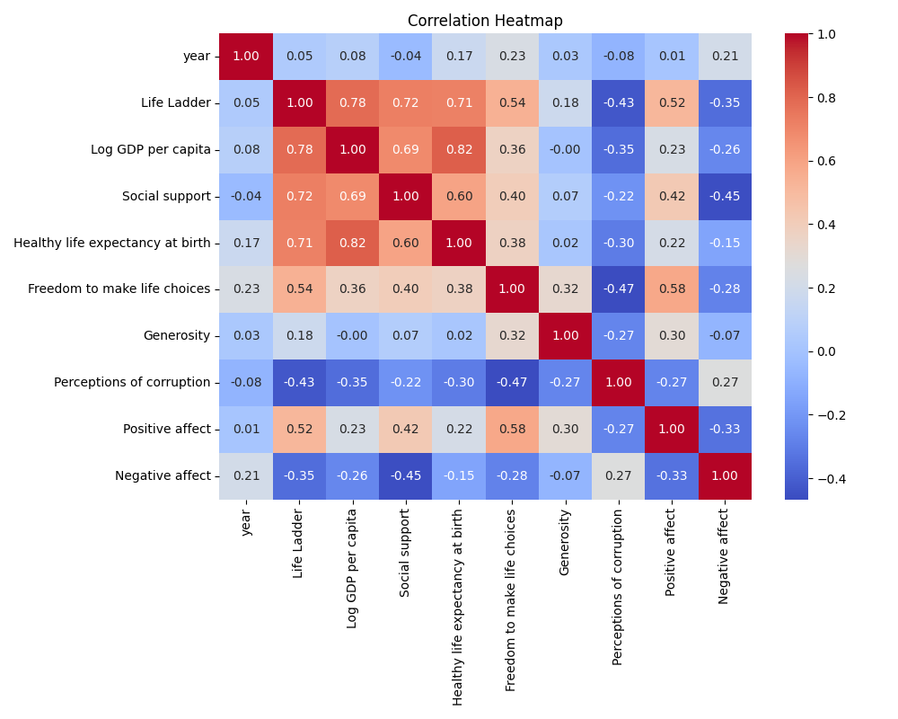

# Automated Data Analysis Report

## Dataset Summary
**Shape:** (2363, 11)

**Column Types:**
- Country name: object
- year: int64
- Life Ladder: float64
- Log GDP per capita: float64
- Social support: float64
- Healthy life expectancy at birth: float64
- Freedom to make life choices: float64
- Generosity: float64
- Perceptions of corruption: float64
- Positive affect: float64
- Negative affect: float64

**Missing Values:**
- Country name: 0
- year: 0
- Life Ladder: 0
- Log GDP per capita: 28
- Social support: 13
- Healthy life expectancy at birth: 63
- Freedom to make life choices: 36
- Generosity: 81
- Perceptions of corruption: 125
- Positive affect: 24
- Negative affect: 16

**Summary Statistics:**
- Country name: {'count': 2363, 'unique': 165, 'top': 'Argentina', 'freq': 18, 'mean': nan, 'std': nan, 'min': nan, '25%': nan, '50%': nan, '75%': nan, 'max': nan}
- year: {'count': 2363.0, 'unique': nan, 'top': nan, 'freq': nan, 'mean': 2014.7638595006347, 'std': 5.059436468192795, 'min': 2005.0, '25%': 2011.0, '50%': 2015.0, '75%': 2019.0, 'max': 2023.0}
- Life Ladder: {'count': 2363.0, 'unique': nan, 'top': nan, 'freq': nan, 'mean': 5.483565806178587, 'std': 1.1255215132391925, 'min': 1.281, '25%': 4.647, '50%': 5.449, '75%': 6.3235, 'max': 8.019}
- Log GDP per capita: {'count': 2335.0, 'unique': nan, 'top': nan, 'freq': nan, 'mean': 9.399671092077089, 'std': 1.1520694444710216, 'min': 5.527, '25%': 8.506499999999999, '50%': 9.503, '75%': 10.3925, 'max': 11.676}
- Social support: {'count': 2350.0, 'unique': nan, 'top': nan, 'freq': nan, 'mean': 0.8093693617021277, 'std': 0.12121176420299144, 'min': 0.228, '25%': 0.744, '50%': 0.8345, '75%': 0.904, 'max': 0.987}
- Healthy life expectancy at birth: {'count': 2300.0, 'unique': nan, 'top': nan, 'freq': nan, 'mean': 63.40182826086957, 'std': 6.842644351828009, 'min': 6.72, '25%': 59.195, '50%': 65.1, '75%': 68.5525, 'max': 74.6}
- Freedom to make life choices: {'count': 2327.0, 'unique': nan, 'top': nan, 'freq': nan, 'mean': 0.750281908036098, 'std': 0.13935703459253465, 'min': 0.228, '25%': 0.661, '50%': 0.771, '75%': 0.862, 'max': 0.985}
- Generosity: {'count': 2282.0, 'unique': nan, 'top': nan, 'freq': nan, 'mean': 9.772129710780206e-05, 'std': 0.16138760312630687, 'min': -0.34, '25%': -0.112, '50%': -0.022, '75%': 0.09375, 'max': 0.7}
- Perceptions of corruption: {'count': 2238.0, 'unique': nan, 'top': nan, 'freq': nan, 'mean': 0.7439709562109026, 'std': 0.1848654805936834, 'min': 0.035, '25%': 0.687, '50%': 0.7985, '75%': 0.86775, 'max': 0.983}
- Positive affect: {'count': 2339.0, 'unique': nan, 'top': nan, 'freq': nan, 'mean': 0.6518820008550662, 'std': 0.10623970474397627, 'min': 0.179, '25%': 0.572, '50%': 0.663, '75%': 0.737, 'max': 0.884}
- Negative affect: {'count': 2347.0, 'unique': nan, 'top': nan, 'freq': nan, 'mean': 0.27315083084789094, 'std': 0.08713107245795021, 'min': 0.083, '25%': 0.209, '50%': 0.262, '75%': 0.326, 'max': 0.705}

## LLM Narrative
The dataset under analysis comprises 2,363 observations across 11 variables relating to various aspects of well-being, economic indicators, and social health across different countries and years. The variables encapsulate critical dimensions such as the "Life Ladder," which serves as a subjective measure of well-being, alongside various economic and social factors like Log GDP per capita, Social support, and perceptions of corruption.

### Summary of Findings:

1. **Life Ladder Scores**: The Life Ladder metric, representing subjective well-being, has an average score of approximately 5.48, with a range from 1.281 to 8.019. This suggests considerable variability in self-reported happiness across countries. The third quartile value is 6.3235, implying that 25% of the data report scores above this threshold, indicating higher levels of life satisfaction. This variability provides an avenue for further exploration to determine which countries excel and which lag in this aspect.

2. **Socioeconomic Factors**:
   - **Log GDP per capita**: The average Log GDP per capita is around 9.40, highlighting a strong correlation between economic wealth and perceived happiness, as higher GDP generally relates to better living standards. 
   - **Social Support**: The average score for social support is 0.81, indicating that many individuals feel they have a reliable support network. Importantly, there are 13 missing values in this variable, suggesting potential biases in these areas that might skew interpretations.
   - **Healthy Life Expectancy**: With an average of 63.4 years, this variable suggests a significant portion of the population experiences good health and longevity, although some countries could be contributing to this average due to lower life expectancies. 

3. **Freedom to Make Life Choices**: The data shows an average score of 0.75, reflecting a generally high level of perceived freedom among populations surveyed. This suggests a trend where the most satisfied citizens may feel they have agency in their lives, tying back to the Life Ladder scores. 

4. **Generosity and Corruption Perceptions**: Interestingly, the Generosity metric shows a very low average (0.00009773) with a high degree of missingness (81 values). This might indicate issues of trust or economic strain in many societies where generosity is limited by personal economic constraints. In contrast, perceptions of corruption have a mean of around 0.744, suggesting that most countries perceive corruption at a moderate level, which could significantly affect the life satisfaction of citizens. 

5. **Affect Variables**: The Positive affect score averages 0.651, while Negative affect averages 0.273. This indicates that, overall, respondents tend to experience greater positive emotions than negative ones, which can be a significant influencer on the Life Ladder scores.

### Suggested Areas for Further Analysis:

- **Temporal Analysis**: Given that the data spans several years, a temporal analysis could highlight trends in life satisfaction and its determinants over time. This could reveal how economic crises or political changes influence well-being metrics.
  
- **Correlation Studies**: Investigating the correlations between demographic variables and the Life Ladder could provide insights into which factors most significantly influence well-being across different countries.

- **Country-Specific Analysis**: A deeper dive into countries with extremely high or low Life Ladder scores could unveil specific cultural, economic, or political factors that lead to these divergences. Countries like Argentina, which appears most frequently in the dataset, could provide rich insights into regional trends.

- **Handling Missing Values**: The dataset presents notable missing values for various variables. Employing techniques to handle these missing values appropriately, be it through imputation or models that can accommodate missingness, would enhance the robustness of analyses conducted from this dataset.

### Conclusion:

In summary, the dataset provides rich insights into the interplay between economic indicators, social dimensions, and subjective well-being across nations. The findings suggest that while wealth, social support, and freedom to choose are crucial, perceptions of corruption and overall health also significantly affect citizens’ reported life satisfaction. To leverage these observations for meaningful policy interventions, further analysis is warranted to explore causal relationships and temporal shifts in these variables.
## Visualizations

