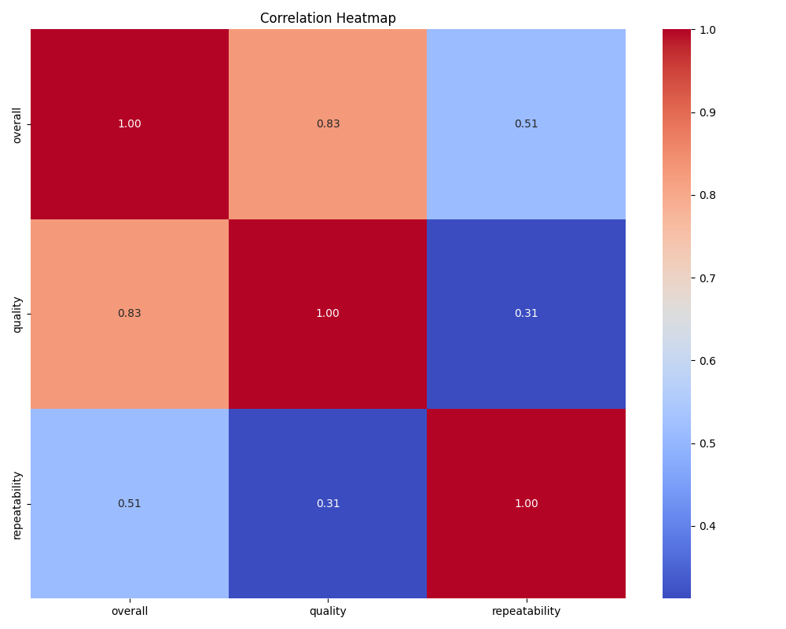

# Automated Data Analysis Report

## Dataset Summary
**Shape:** (2652, 8)

**Column Types:**
- date: object
- language: object
- type: object
- title: object
- by: object
- overall: int64
- quality: int64
- repeatability: int64

**Missing Values:**
- date: 99
- language: 0
- type: 0
- title: 0
- by: 262
- overall: 0
- quality: 0
- repeatability: 0

**Summary Statistics:**
- date: {'count': 2553, 'unique': 2055, 'top': '21-May-06', 'freq': 8, 'mean': nan, 'std': nan, 'min': nan, '25%': nan, '50%': nan, '75%': nan, 'max': nan}
- language: {'count': 2652, 'unique': 11, 'top': 'English', 'freq': 1306, 'mean': nan, 'std': nan, 'min': nan, '25%': nan, '50%': nan, '75%': nan, 'max': nan}
- type: {'count': 2652, 'unique': 8, 'top': 'movie', 'freq': 2211, 'mean': nan, 'std': nan, 'min': nan, '25%': nan, '50%': nan, '75%': nan, 'max': nan}
- title: {'count': 2652, 'unique': 2312, 'top': 'Kanda Naal Mudhal', 'freq': 9, 'mean': nan, 'std': nan, 'min': nan, '25%': nan, '50%': nan, '75%': nan, 'max': nan}
- by: {'count': 2390, 'unique': 1528, 'top': 'Kiefer Sutherland', 'freq': 48, 'mean': nan, 'std': nan, 'min': nan, '25%': nan, '50%': nan, '75%': nan, 'max': nan}
- overall: {'count': 2652.0, 'unique': nan, 'top': nan, 'freq': nan, 'mean': 3.0475113122171944, 'std': 0.7621797580962717, 'min': 1.0, '25%': 3.0, '50%': 3.0, '75%': 3.0, 'max': 5.0}
- quality: {'count': 2652.0, 'unique': nan, 'top': nan, 'freq': nan, 'mean': 3.2092760180995477, 'std': 0.7967426636666686, 'min': 1.0, '25%': 3.0, '50%': 3.0, '75%': 4.0, 'max': 5.0}
- repeatability: {'count': 2652.0, 'unique': nan, 'top': nan, 'freq': nan, 'mean': 1.4947209653092006, 'std': 0.598289430580212, 'min': 1.0, '25%': 1.0, '50%': 1.0, '75%': 2.0, 'max': 3.0}

## LLM Narrative
The provided dataset consists of 2,652 entries across eight columns, which include information about various media such as movies or shows. The columns capture the date of entry, language, type, title, creator (the person "by" whom it was created), and numerical ratings for overall quality, quality of content, and repeatability. 

### Key Observations:

1. **Data Completeness**: 
   - There are missing values in the dataset, particularly notable in the `date` and `by` columns. The `date` column has 99 missing entries, which could affect time-based analyses. The `by` column has 262 missing entries, indicating that a significant number of entries do not have an associated creator identified. This should be addressed depending on the analysis intended.

2. **Language Analysis**:
   - The dataset features 11 unique languages, with English being the most prevalent (1,306 occurrences). This variance in language indicates a diverse dataset potentially covering global content but emphasizes a strong bias toward English.

3. **Type Distribution**:
   - The dataset predominantly consists of 'movie' entries (2,211 occurrences), suggesting that the collection is largely focused on film rather than TV shows or other media types. This distinction could impact qualitative assessments if a significant trend is expected across different media formats.

4. **Title Variety**:
   - With 2,312 unique titles, there seems to be a high level of diversity in the content being recorded. The title 'Kanda Naal Mudhal' appears most frequently (9 times), hinting either at significant interest in this title or possibly the documentation of various versions or editions.

5. **Creator Insights**:
   - The `by` column shows 1,528 unique creators, but with a notable frequency of 48 for Kiefer Sutherland. This indicates a variety of contributors while highlighting that some individuals might dominate the dataset in terms of mentions.

6. **Rating Distribution** (numerical analysis):
   - The `overall` rating has a mean of about 3.05, based on a 1-5 rating scale, revealing a generally positive view of the content, as the majority of ratings cluster around the median value of 3. 
   - The `quality` and `repeatability` ratings reflect similar distributions, with means of approximately 3.21 and 1.49, respectively. The repeatability score suggests that most content is not frequently revisited, as it skews towards 1.
   - The spread of `quality` ratings is interesting; while many entries lie in the middle (1-3), almost 25% received ratings of 4 or 5, which could prompt an exploration into what criteria led to these higher scores.

### Suggested Areas for Further Exploration:

1. **Temporal Trends**:
   - Analyzing the temporal distribution of media entries over time could unveil patterns such as emerging genres, shifts in viewer preferences, or impacts of significant industry events on content production.

2. **Language vs. Quality**:
   - Investigating the relationship between the language of the content and its quality or overall ratings could be insightful, particularly whether certain languages correlate with higher/ lower ratings.

3. **Type vs. Ratings**:
   - A more detailed study could reveal if the type (movies vs. other formats) impacts perceived quality, as well as if audience engagement measures relate to different types.

4. **Creator Influence**:
   - Delving deeper into the creators could uncover trends about prolific creators and their typical quality ratings, addressing whether specific creators deliver consistently higher or lower-rated works.

5. **Addressing Missing Data**:
   - An important step in any predictive approach could involve strategies for handling the missing data in both the `date` and `by` fields. This could include data imputation methods or analyzing the implications of excluding those rows.

In conclusion, this dataset provides a rich environment for multiple lines of inquiry focusing on various aspects of the media it encompasses. Addressing missing data, exploring correlations, and examining how different variables interact with one another will uncover deeper insights into media trends and consumer perceptions.
## Visualizations

